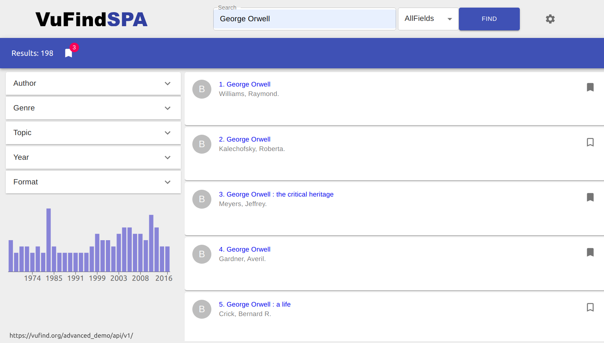

# VuFindSPA

[](https://app.netlify.com/sites/vufindspa/deploys)

This is an experimental SPA and PWA for VuFind.

https://vufindspa.netlify.app



## Quick Start

```git clone https://github.com/leanderseige/vufindspa```

Get your copy of the source code.

```npm install```

Install all the dependencies.

```npm start```

Run the app in the development mode.<br />
Open [http://localhost:3000](http://localhost:3000) to view it in the browser.

The page will reload if you make edits.<br />
You will also see any lint errors in the console.

```npm run build```

Builds the app for production to the `build` folder.<br />
It correctly bundles React in production mode and optimizes the build for the best performance.

Further info in (CRA-README.md)[https://github.com/leanderseige/vufindspa/edit/master/CRA-README.md]

## Known Bugs

* ~~Android's Keyboard may ruin layout, use iOS or just fix the responsiveness~~ fixed
